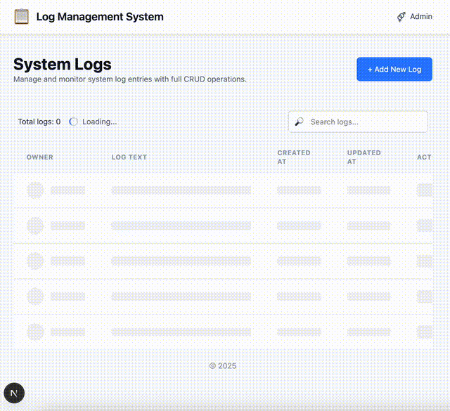

# 📝 Log System Web Interface

This project is a fully responsive log management interface built with **Next.js 15**, **React 19**, **TypeScript**, and **Tailwind CSS** — without any third-party UI or form libraries.


## 🔧 Tech Stack

- **Frontend:** React 19, Next.js 15 (App Router)
- **Styling:** Tailwind CSS only
- **State Management:** Zustand
- **API:** Implemented using Next.js API routes
- **Tests:** Vitest
- **Deployment:** Docker, GitHub Actions CI/CD

---

## ✅ Features Implemented

### 🧾 Logs Table

- Columns:
  - **Owner** (editable)
  - **Created At** (read-only)
  - **Updated At** (read-only)
  - **Log Text** (editable)
- Full **CRUD** operations: create, edit, delete
- **Pagination** for viewing more than 10 logs
- **Search functionality** by Owner or Log Text

### 💬 Toast Notifications

- Custom-built, lightweight toast notifications with Tailwind
- Displayed on success/failure of user actions

### 🪟 Modal System

- Modal confirmation for delete actions
- Reusable modal component with animation using Tailwind transitions
- Modal state handled via custom context provider

### ⏳ Loading Indicators

- Animated spinner during API loading states
- Artificial delay added to simulate network latency and show spinners clearly

### 🧪 Testing

- Unit tests for actions written using **Vitest**
- Example: `createLogEntryAction.test.ts`

### 🌐 Responsive Layout

- Fully responsive layout from **320px and up**
- Tailwind breakpoints used (sm, md, lg)
- Works well on mobile, tablet, and desktop

### 🚀 Deployment

- CI/CD pipeline using **GitHub Actions**
- **Dockerized** app: `Dockerfile` + `docker-compose.yml`
- Server deployment automated after push to `main` branch

### ⚙️ API

Custom API endpoints implemented inside Next.js:

- `GET /api/logs` – fetch all logs
- `POST /api/logs` – create new log
- `PATCH /api/logs/[id]` – update existing log
- `DELETE /api/logs/[id]` – delete log

Backed by a **JSON file** used as a local database (see `data/logEntries.json`).

---

## 🧠 Design Decisions

- No third-party UI kits or form libs — only **Tailwind CSS**
- Only one external state library used: **Zustand**
- Icons implemented as **emoji** to avoid additional dependencies
- API requests are made with **native fetch** to avoid relying on libraries like Axios (requirement not explicitly approved)
- Code structure follows a modular pattern with clear separation:
  - `src/app` – Next.js pages and routing
  - `src/components/` – UI components
  - `src/lib/` – server logic and helpers (e.g., actions, validation)
  - `src/store/` – Zustand store for managing state
  - `src/provider/` – Toast and Modal providers

---

## 📁 Folder Structure

```
src/
├── app/                    # App routes
│   └── api/                # API endpoints for logs
├── components/
│   ├── layout/             # Header, Footer, Modal, Pagination
│   ├── logEntry/           # LogsTable, Add/Edit/Delete forms
│   └── ui/                 # Reusable UI (Button, SubmitButton)
├── lib/
│   ├── actions/            # Server actions for CRUD
│   └── validateLogEntry.ts # Shared validation logic
├── provider/               # Context providers (Toast, Modal)
├── store/                  # Zustand store (useLogsStore)
└── styles/                 # Tailwind config and global styles
```

---

## 🧪 Tests

- Example: `createLogEntryAction.test.ts`
- Run with:

```bash
pnpm test
```

---

## 🐳 Docker & Deployment

### 🧱 Build

```bash
docker build -t log-app .
```

### ▶️ Run

```bash
docker-compose up --build -d
```

### 🛑 Stop

```bash
docker-compose down
```

### 🔁 Auto Deployment

Configured via **GitHub Actions**:

- SSHs into server
- Clones latest `main` branch
- Rebuilds and restarts Docker containers

---

## 🛠 Setup Instructions

1. Clone the repository:

```bash
git clone <repo-url>
cd project-directory
```

2. Install dependencies:

```bash
pnpm install
```

3. Create a `.env.local` file if needed:

```env
BASE_URL=http://localhost:3000
```

4. Run the app locally:

```bash
pnpm dev
```

---

## 🖼 Screenshots

[](assets/demo.mp4)

---

## 📜 License

MIT
